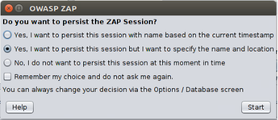
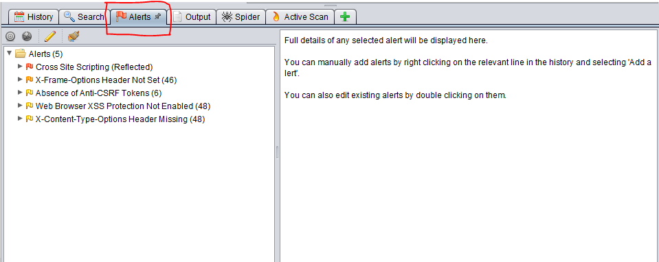

# Project1

Documentation

I started my project by doing some penetration testing.
To do so i had to set up the right environment, i was recommened using a Linux/Unix machine when it comes to pentesting
purely for the terminal and sheer number of tools available. 

Setting up Kali Linux and Pentester VM

Step 1 - Install Kali Linux

 Visit the link below: 
 https://www.kali.org/downloads/
 Install the appropriate Image, I downloaded the Kali Linux 64-Bit Version 2019.3
 
 
 
Step 2 - Open Oracle VM to deploy the Kali Linux Image

 - Click New
 - Enter a Name
 - Type "Linux"
 - Version: Pick your Kali linux image version
 - Click Next
 - Allocate Memory Size: I used 8GB
 - Select "Create a virtual hard disk now" and click "Create"
 - Select VDI and go "Next"
 - Select "Dynamically allocated"
 - Allocate hard disk size, I chose 20GB
 - Click "Create"
 - Right click the recently created VM and click "Settings"
 - Click storage and click the "Add optical drive icon"
 - Select the recently downloaded Kali Linux Image then click "OK"
 - Run the VM and navigate through the steps to personalize your new Kali Linux machine.

Step 3 - Get the pentester VM running to begin pentesting

 - Follow the link below:
 - https://www.pentesterlab.com/exercises/web_for_pentester/attachments
 - Download the ISO 
 - Open Oracle VM
 - Create a new VM using the steps used in "Step 2"
 - Right click the recently created VM and click "Settings"
 - Click storage and click the "Add optical drive icon"
 - Select the recently downloaded pentester ISO then click "OK"
 - Run through the setup process of the new VM
 - Once the terminal has loaded for the new VM use the "ifconfig" command
 - Take note of the inet addr listed under eth0
 
 
 
 - Enter this IP into your Kali Linux Browser to start using the Pen tester web applications.
 
 
 
Installing ZAP on Linux AND windows

Step 1 - Installing ZAP on Kali Linux machine

 - Open the Kali Linux Terminal and enter the following command:
 - wget https://github.com/zaproxy/zaproxy/wiki/Downloads
 - Add the correct permissions which allow us to execute the installer:
 - chmod u+x ZAP_2_8_0_unix.sh
 - Run the installer using sudo
 - sudo ./ZAP_2_8_0_unix.sh
 - Follow the instructions on the install wizard. When prompted, select "Standard Installation"
 - Use the ZAP tool by using the following command in the terminal
 - "zap.sh"
 - A dialogue box will appear as displayed below:
 
 
 
  - Enter a URL in the "URL to attack column"
  - Click "Attack"
  - I recommend using one of the pentester URLS and working through these to test the different results from each
  - Once the scan has been completed click on the Alerts tab down the bottom of the screen shown below:
  
  
  
  - When looking through the Alerts folder keep in mind that Red is often a serious Vulnerability while they get less
  and less serious as the flags get lighter in colour.
  - Click the small arrow beside the red flagged address
  
  
  
  - Look through the output and review through the information on the right hand pane.
  
  <html>" script on the name parameter will expose a 
    exploit in the web application. 
  - Working through each of the Pentester web applications and testing the different results is a good learning convention.
  - Something to note: 
    - ZAP does not find 100% of vulnerabilities on a web application and there are often many vulnerabilities that can be missed.
	- This means having your own hard coding knowledge on vulnerabilities will come in handy
  - Useful link for more information on ZAP is linked below
  
  https://resources.infosecinstitute.com/introduction-owasp-zap-web-application-security-assessments/#gref
	
  	
	
 
 
 
 
 
 - 

 
 
 
 

