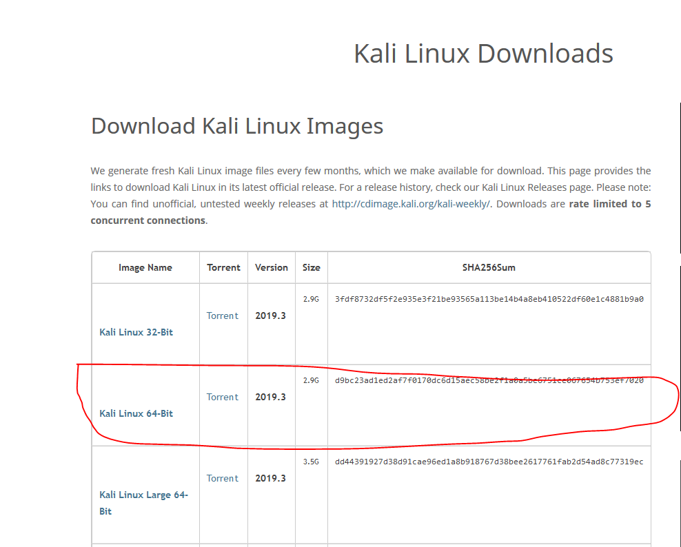

# Project1

Documentation

I started my project by doing some penetration testing.
To do so i had to set up the right environment, i was recommened using a Linux/Unix machine when it comes to pentesting
purely for the terminal and sheer number of tools available. 

Setting up Kali Linux

Step 1 - Install Kali Linux

 Visit the link below: 
 https://www.kali.org/downloads/
 Install the appropriate Image, I downloaded the Kali Linux 64-Bit Version 2019.3
 
 
 
Step 2 - Open Oracle VM to delpoy the Kali Linux Image
 - Click New
 - Enter a Name
 - Type "Linux"
 - Version: Pick your Kali linux image version
 - Click Next
 - Allocate Memory Size: I used 8GB
 - Select "Create a virtual hard disk now" and click "Create"
 - Select VDI and go "Next"
 - Select "Dynamically allocated"
 - Allocate hard disk size, I chose 20GB
 - Click "Create"
 - Right click the recently created VM and click "Settings"
 - Click storage and click the "Add optical drive icon"
 - Select the recently downloaded Kali Linux Image then click "OK"
 - Run the VM and navigate through the steps to personalize your new Kali Linux machine.

 
 
 
 

